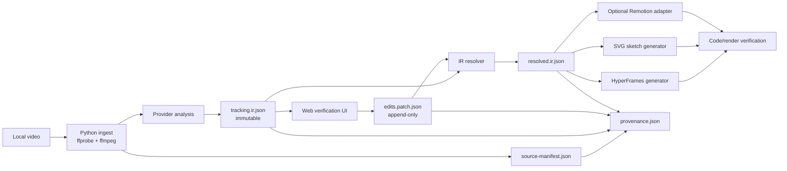

# Architecture

## System boundary

The core system operates on a local file path. Networked model calls, cloud storage, and external media upload are outside the default path and must be separate opt-in integrations. The source video is never copied into repository fixtures or reports.



## Package boundaries

| Package | Language | Responsibility | Must not own |
| --- | --- | --- | --- |
| `analyzer-python` | Python | ffmpeg ingest, timing tables, provider execution, IR emission | UI state or renderer-specific source |
| `shared-schema` | JSON Schema + generated bindings | IR, EditSpec, patch, provenance, reports, profile schema | tracker implementation |
| `verifier-web` | TypeScript | Video/frame overlay, review actions, patch authoring, visual comparisons | mutating original IR |
| `generator-hyperframes` | TypeScript | Resolved IR to deterministic HyperFrames project | analysis or free-text interpretation |
| `generator-sketch-svg` | TypeScript | Precise path geometry plus style pass | source-video decoding |
| `export-remotion` | TypeScript | Optional IR-to-Remotion adapter | becoming the primary generator |

The CLI is a thin orchestrator. It validates paths and schemas, invokes packages, writes explicit artifacts, and fails with a structured status. It must not conceal a provider failure by returning a partial successful-looking project.

## Analysis provider contract

All providers receive a source manifest and sampled frames/timestamps, then return either valid observations or a structured failure.

```text
analyze(source_manifest, sampling_plan, provider_config)
  -> ProviderResult {
       observations[], confidence_summary, warnings[],
       provider_name, provider_version, model_identifier, license_hint
     }
```

- `PoseProvider`: MediaPipe is the default. Emits 33 normalized landmarks, visibility/presence where available, bounding boxes, and identity lifecycle.
- `ObjectProvider`: automatic detector/tracker or user-seeded ROI tracker. A manual ROI is an input event recorded in patch/provenance, never a hidden UI-only setting.
- `CameraMotionProvider`: emits source-to-stabilized transforms, estimation method, inlier statistics, and confidence.

Provider outputs are converted at the boundary to the renderer-independent IR. Optional models cannot alter the IR schema and must declare their own installation and license conditions.

## Coordinate and time contract

1. `sourceTimeMs` is the canonical time. Frame indices are derived views, not the sole timing authority.
2. Original presentation timestamps are retained to handle variable-frame-rate input.
3. `screenSpace` coordinates are normalized to `[0, 1]` in the decoded source display orientation.
4. `stabilizedSpace` is derived from a versioned camera transform. The transform and its confidence remain in the IR.
5. A profile maps normalized source coordinates into a target canvas using explicit crop, scale, translation, and safe-area constraints.
6. Pixel coordinates may appear in a derived artifact, but IR never relies on an unlabelled pixel coordinate system.

## Artifact lifecycle

| Artifact | Writer | Mutability | Purpose |
| --- | --- | --- | --- |
| `source-manifest.json` | ingest | immutable | Source hash, streams, timing, decode orientation |
| `tracking.ir.json` | analysis | immutable | Raw normalized observations and quality evidence |
| `edits.patch.json` | UI/CLI | append-only revisions | Human/agent decisions and corrections |
| `resolved.ir.json` | resolver | reproducible derived output | Raw IR plus ordered valid patches |
| generated project | generator | disposable/reproducible | HyperFrames/SVG/Remotion source |
| `report.json` | orchestrator | immutable run report | warnings, approvals, paths, status |
| `provenance.json` | orchestrator | immutable | Inputs, versions, hashes, generator mapping |

## Review and render boundary

Generation is permitted when:

- relevant tracks are manually approved; or
- `auto-review` approved them and no blocking warning exists; or
- an explicit human override is recorded with a reason.

The generator emits source maps that relate generated DOM/SVG identifiers to `trackId`, `timeRange`, coordinate space, and patch operation IDs. This allows the verification UI to explain a rendered mismatch instead of treating it as an opaque visual defect.

## HyperFrames contract for generated projects

The HyperFrames generator must compile resolved IR into a deterministic HTML composition rather than simulate timing at render time. Its generated project must:

- use an explicitly sized composition and explicit width, height, duration, fps/profile metadata;
- declare composition start/timing and render tracks in source, not hidden runtime state;
- construct one seek-safe, paused timeline synchronously for each composition;
- avoid clocks, unseeded randomness, network fetches, and infinite animation loops;
- let the framework own video/audio playback and seeking;
- use a full-bleed child for visual backgrounds rather than relying on a root-only background;
- pass lint/check plus inspected snapshots before a user-approved final render.

The actual generated HTML template belongs to Phase 4. This document defines the compiler boundary, not a temporary substitute template.
